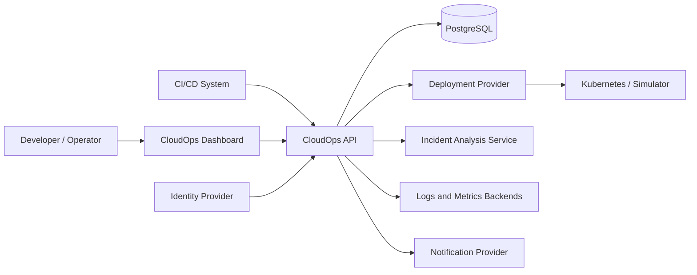
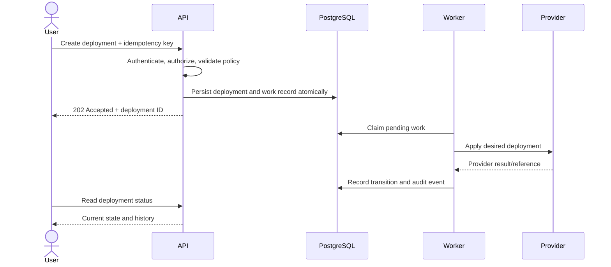

# Architecture

**Status:** Accepted direction; implementation incomplete

## Architectural style

CloudOps begins as a modular monolith. This keeps transactions, testing, and
local development simple while enforcing boundaries that can later become
separate services if scale or team ownership requires it.

Dependencies point inward:

```text
HTTP / persistence / messaging / provider adapters
                    |
                    v
            application use cases
                    |
                    v
          domain model and policies
```

The domain must not import Spring MVC, JPA, Kafka, Redis, or Kubernetes types.

## System context



## Logical containers

| Container | Responsibility | Initial technology |
| --- | --- | --- |
| Web dashboard | User workflows and operational views | React/TypeScript, proposed |
| CloudOps API | Domain rules, orchestration, authorization, persistence | Java 21/Spring Boot |
| Worker | Asynchronous deployment and analysis jobs | Initially same deployable; later separable |
| Database | Transactional source of truth | PostgreSQL |
| Event broker | Durable asynchronous integration | Kafka, deferred until required |
| Cache/idempotency store | Measured caching, rate limiting, short-lived coordination | Redis, deferred until required |
| Analysis service | Structured failure analysis | FastAPI, proposed |
| Deployment target | Executes desired workload state | Simulator, then Kubernetes |

## Backend module boundaries

```text
identity       users, service identities, roles, access policy
application    application catalog and ownership
deployment     requests, lifecycle, orchestration, provider ports
environment    environments, clusters, quotas, deployment policy
operations     health, logs, scaling, restart, operational actions
incident       evidence collection and AI-assisted analysis
notification   subscriptions and delivery attempts
audit          immutable security and operational history
shared         narrowly scoped primitives; no dumping ground
```

Each module should expose use cases and domain-facing ports. Database entities,
controllers, message consumers, and external clients remain adapters.

## Deployment request flow



An outbox pattern is the preferred boundary when publishing durable events:
domain changes and outbox records commit in one database transaction, followed
by at-least-once publication. Consumers must therefore be idempotent.

## Deployment state model

Proposed baseline:

```text
PENDING -> QUEUED -> DEPLOYING -> RUNNING
   |          |          |
   +----------+----------+-> FAILED
              +------------> CANCELLED (when eligible)
```

Exact transitions and cancellation semantics must be captured in domain tests.

